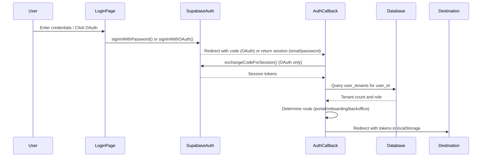

# Design Document: Authentication and Deployment Fix

## Overview

This design addresses authentication and deployment issues in the ClubeeShopMkt production environment. The system already has authentication flows implemented using Supabase Auth with both Google OAuth and email/password methods. This design focuses on verification, testing, and fixing any issues to ensure production readiness.

The authentication system follows a multi-tenant architecture where users can be associated with zero, one, or multiple tenants (shops). After authentication, users are routed based on their role and tenant assignments:
- Superadmins → /portal (multi-tenant management)
- New users (0 tenants) → /onboarding (create first shop)
- Regular users (1+ tenants) → /backoffice (manage their shop)

## Architecture

### High-Level Flow

```
User → Login/Signup Page → Supabase Auth → Auth Callback → User Routing → Destination
                                                                ↓
                                                    Query user_tenants table
                                                                ↓
                                            Determine: superadmin | new user | existing user
```

### Component Interaction



## Components and Interfaces

### 1. Environment Configuration Module

**Location:** `app/lib/supabase.server.ts`, `app/root.tsx`

**Responsibilities:**
- Validate environment variables on server startup
- Expose public variables to client safely
- Provide Supabase client factory functions

**Interface:**
```typescript
interface Env {
  SUPABASE_URL: string;
  SUPABASE_ANON_KEY: string;
  SUPABASE_JWT_SECRET?: string;
}

function createSupabaseClient(env: Env, authHeader?: string): SupabaseClient
function validateEnvironment(env: Env): { valid: boolean; errors: string[] }
```

**Key Functions:**
- `createSupabaseClient()`: Creates authenticated Supabase client
- `validateEnvironment()`: Checks all required env vars are present and valid
- Root loader: Exposes SUPABASE_URL and SUPABASE_ANON_KEY to client via window.ENV

### 2. Authentication Module

**Location:** `app/lib/auth.ts`, `app/routes/login.tsx`, `app/routes/signup.tsx`

**Responsibilities:**
- Handle email/password authentication
- Handle Google OAuth flow
- Manage session tokens in localStorage
- Provide client-side auth utilities

**Interface:**
```typescript
// Client-side auth functions
function createBrowserSupabaseClient(): SupabaseClient
function signInWithGoogle(redirectTo?: string): Promise<OAuthResponse>
function signOut(): Promise<void>
function getStoredSession(): { access_token: string; refresh_token: string } | null

// Server-side action handlers
async function loginAction(request: Request, context: Context): Promise<Response>
async function signupAction(request: Request, context: Context): Promise<Response>
```

**Key Flows:**

**Email/Password Login:**
1. User submits form with email and password
2. Server calls `supabase.auth.signInWithPassword()`
3. On success, return session tokens to client
4. Client stores tokens in localStorage
5. Client redirects to /backoffice (routing handled client-side for email/password)

**Email/Password Signup:**
1. User submits form with email, password, and confirmation
2. Validate password length (≥6) and match
3. Server calls `supabase.auth.signUp()`
4. Check if user already exists (identities.length === 0)
5. On success, show success message and link to login

**Google OAuth:**
1. User clicks "Continue with Google"
2. Server calls `supabase.auth.signInWithOAuth()` with redirectTo callback URL
3. Server redirects to Google consent screen
4. Google redirects back to /auth/callback with authorization code
5. Auth callback exchanges code for session (handled by callback module)

### 3. Auth Callback Module

**Location:** `app/routes/auth.callback.tsx`

**Responsibilities:**
- Handle OAuth redirect from Google
- Exchange authorization code for session
- Determine user routing based on tenant assignments
- Store tokens and redirect to appropriate destination

**Interface:**
```typescript
async function loader(args: LoaderFunctionArgs): Promise<LoaderData>
async function getPostAuthRedirect(
  supabase: SupabaseClient,
  userId: string,
  userEmail: string
): Promise<string>

interface LoaderData {
  error?: string;
  session?: {
    access_token: string;
    refresh_token: string;
  };
  redirectTo: string;
}
```

**Key Logic:**

**User Routing Algorithm:**
```typescript
function getPostAuthRedirect(supabase, userId, userEmail) {
  // Check if superadmin (hardcoded email check)
  if (userEmail === 'cavernacentral2@gmail.com') {
    return '/portal';
  }
  
  // Query user_tenants table
  const userTenants = await supabase
    .from('user_tenants')
    .select('tenant_id, role')
    .eq('user_id', userId);
  
  const tenantCount = userTenants?.length ?? 0;
  
  if (tenantCount === 0) {
    return '/onboarding';  // New user needs to create tenant
  } else {
    return '/backoffice';  // Existing user with tenant(s)
  }
}
```

**Error Handling:**
- OAuth provider errors → Display error message, redirect to home after 3s
- Missing authorization code → Display error, redirect to home
- Code exchange failure → Display error, redirect to home
- Database query errors → Default to /onboarding (safe fallback)

### 4. Onboarding Module

**Location:** `app/routes/onboarding.tsx`

**Responsibilities:**
- Collect shop name and subdomain from new users
- Validate subdomain availability and format
- Create tenant and user_tenant records
- Redirect to backoffice after successful tenant creation

**Interface:**
```typescript
async function action(args: ActionFunctionArgs): Promise<Response>

interface ActionData {
  error?: string;
  fieldErrors?: {
    shopName?: string;
    subdomain?: string;
  };
  success?: boolean;
}
```

**Key Logic:**

**Tenant Creation Flow:**
```typescript
async function createTenant(formData, userId, supabase) {
  // 1. Validate inputs
  const shopName = formData.get('shopName').trim();
  const subdomain = formData.get('subdomain').trim().toLowerCase();
  
  // Validate shop name: 2-50 characters
  // Validate subdomain: 3-30 characters, lowercase alphanumeric + hyphens
  
  // 2. Check subdomain uniqueness
  const existing = await supabase
    .from('tenants')
    .select('id')
    .eq('subdomain', subdomain)
    .single();
  
  if (existing) {
    return error('Subdomain already taken');
  }
  
  // 3. Create tenant
  const tenant = await supabase
    .from('tenants')
    .insert({ name: shopName, subdomain, settings: {} })
    .select()
    .single();
  
  // 4. Create user_tenant record
  await supabase
    .from('user_tenants')
    .insert({ user_id: userId, tenant_id: tenant.id, role: 'owner' });
  
  // 5. Refresh JWT to include tenant_id claim
  await supabase.rpc('refresh_user_tenant_claim', { p_user_id: userId });
  
  // 6. Redirect to backoffice
  return redirect('/backoffice');
}
```

**Rollback on Failure:**
If user_tenant creation fails, delete the created tenant to maintain consistency.

### 5. Session Management Module

**Location:** Client-side (localStorage), `app/lib/auth.ts`

**Responsibilities:**
- Store access and refresh tokens in localStorage
- Retrieve tokens on page load
- Clear tokens on sign out
- Handle token refresh (future enhancement)

**Interface:**
```typescript
// Token storage keys
const ACCESS_TOKEN_KEY = 'sb-access-token';
const REFRESH_TOKEN_KEY = 'sb-refresh-token';

// Functions
function storeTokens(accessToken: string, refreshToken: string): void
function getStoredTokens(): { access_token: string; refresh_token: string } | null
function clearTokens(): void
```

**Storage Strategy:**
- Use localStorage for persistence across page reloads
- Store tokens after successful authentication
- Retrieve tokens when creating browser Supabase client
- Clear tokens on sign out or auth errors

## Data Models

### User (Supabase Auth)

Managed by Supabase Auth service. Key fields:
- `id` (UUID): User identifier
- `email` (string): User email address
- `created_at` (timestamp): Account creation time
- `identities` (array): OAuth provider identities

### Tenant

```typescript
interface Tenant {
  id: string;              // UUID
  name: string;            // Shop name (2-50 chars)
  subdomain: string;       // Unique subdomain (3-30 chars)
  settings: object;        // JSON configuration
  created_at: string;      // ISO timestamp
}
```

### User_Tenant

```typescript
interface UserTenant {
  user_id: string;         // Foreign key to auth.users
  tenant_id: string;       // Foreign key to tenants
  role: string;            // 'owner', 'staff', etc.
}
```

**Primary Key:** Composite (user_id, tenant_id)

**Relationships:**
- One user can have multiple tenant assignments
- One tenant can have multiple user assignments
- Role determines permissions within the tenant

## Correctness Properties

*A property is a characteristic or behavior that should hold true across all valid executions of a system—essentially, a formal statement about what the system should do. Properties serve as the bridge between human-readable specifications and machine-verifiable correctness guarantees.*


### Property Reflection

After analyzing all acceptance criteria, I've identified the following testable properties. Some properties have been combined to eliminate redundancy:

**Combined Properties:**
- Properties 4.1 and 4.2 (storing access and refresh tokens) can be combined into a single property about token storage
- Properties 1.1 and 1.2 (validating SUPABASE_URL and SUPABASE_ANON_KEY) can be combined into environment validation
- Properties 5.3 and 5.4 (routing based on tenant count) can be combined into a single routing property
- Properties 6.1 and 6.2 (creating tenant and user_tenant records) represent a transaction that should be tested together

**Excluded from Properties:**
- Requirements 8.x and 10.x are end-to-end integration tests, not unit test properties
- Requirements about UI timing, visual feedback, and RLS policies are not suitable for unit testing
- Token refresh (4.4, 4.5) is a future enhancement not currently implemented

### Correctness Properties

Property 1: Environment variable validation
*For any* environment configuration object, validating it should return errors for missing or invalid SUPABASE_URL and SUPABASE_ANON_KEY, and success when both are valid URLs/keys
**Validates: Requirements 1.1, 1.2**

Property 2: Client environment exposure security
*For any* environment configuration, when exposing variables to the client, the exposed object should only contain SUPABASE_URL and SUPABASE_ANON_KEY and never contain SUPABASE_JWT_SECRET or other sensitive values
**Validates: Requirements 1.4**

Property 3: Environment validation logging
*For any* invalid environment configuration, the validation function should generate descriptive error messages indicating which variables are missing or invalid
**Validates: Requirements 1.3**

Property 4: Token storage after authentication
*For any* successful authentication response containing access and refresh tokens, storing the session should result in both tokens being present in localStorage under the correct keys
**Validates: Requirements 4.1, 4.2, 2.4**

Property 5: Token retrieval consistency
*For any* tokens stored in localStorage, retrieving the session should return the same access and refresh token values that were stored
**Validates: Requirements 4.3**

Property 6: Token clearing on sign out
*For any* authentication state, after calling signOut, localStorage should not contain any authentication tokens
**Validates: Requirements 4.6**

Property 7: User routing based on tenant count
*For any* user with a given tenant count (0, 1, or more), the routing function should return '/onboarding' for 0 tenants, '/backoffice' for 1+ tenants, and '/portal' for superadmin email
**Validates: Requirements 5.2, 5.3, 5.4**

Property 8: Password validation
*For any* password string, validation should reject passwords with length less than 6 characters and accept passwords with length 6 or greater
**Validates: Requirements 3.5**

Property 9: Invalid credentials error consistency
*For any* invalid login credentials (wrong email or wrong password), the error message should be generic and not reveal whether the email exists in the system
**Validates: Requirements 3.4**

Property 10: Subdomain validation
*For any* subdomain string, validation should reject subdomains that are less than 3 characters, more than 30 characters, contain uppercase letters, contain special characters other than hyphens, or start/end with hyphens
**Validates: Requirements 6.6**

Property 11: Shop name validation
*For any* shop name string, validation should reject names less than 2 characters or more than 50 characters, and accept names within this range
**Validates: Requirements 6.6**

Property 12: Tenant creation atomicity
*For any* valid shop name and subdomain, if tenant creation succeeds but user_tenant creation fails, the tenant record should be rolled back (deleted)
**Validates: Requirements 6.4**

Property 13: Authentication error logging
*For any* Supabase authentication error, the system should log the technical error details while displaying a user-friendly message to the user
**Validates: Requirements 7.2, 7.5**

Property 14: Form validation error display
*For any* form submission with validation errors, each invalid field should have a corresponding error message displayed
**Validates: Requirements 7.4**

Property 15: Database query authentication
*For any* database query, the Supabase client should be created with the authentication header from the request when available
**Validates: Requirements 9.1**

Property 16: User-specific tenant queries
*For any* user_tenants query, the query should filter by the authenticated user's ID to ensure only their tenant assignments are returned
**Validates: Requirements 9.3**

Property 17: Tenant record completeness
*For any* tenant creation, the inserted record should include name, subdomain, and settings fields with valid values
**Validates: Requirements 9.4**

Property 18: Database error handling
*For any* database query that fails, the system should log the error and return an HTTP response with an appropriate error status code (4xx or 5xx)
**Validates: Requirements 9.6**

## Error Handling

### Error Categories

**1. Configuration Errors**
- Missing environment variables
- Invalid Supabase URL or API key
- OAuth provider not configured

**Strategy:** Fail fast on startup, log detailed errors, provide clear user messages

**2. Authentication Errors**
- Invalid credentials
- Duplicate email on signup
- OAuth code exchange failure
- Session token errors

**Strategy:** Return generic user messages for security, log technical details, provide recovery paths

**3. Validation Errors**
- Invalid email format
- Password too short
- Passwords don't match
- Invalid subdomain format
- Shop name out of range

**Strategy:** Client-side validation with immediate feedback, server-side validation as backup, field-specific error messages

**4. Database Errors**
- Connection failures
- Query errors
- Constraint violations (duplicate subdomain)
- Transaction rollback failures

**Strategy:** Log full error details, return user-friendly messages, implement rollback for partial failures

**5. Network Errors**
- Supabase API unreachable
- Timeout errors
- DNS resolution failures

**Strategy:** Detect network errors, suggest checking connection, provide retry mechanisms

### Error Response Format

```typescript
interface ErrorResponse {
  error: string;              // User-friendly message
  fieldErrors?: {             // Field-specific validation errors
    [field: string]: string;
  };
  code?: string;              // Error code for client handling
}
```

### Logging Strategy

**Production Logging:**
- Log all authentication errors with user ID (if available)
- Log environment validation failures
- Log database errors with query context
- Never log passwords or tokens
- Include request ID for tracing

**Development Logging:**
- Log OAuth redirect URLs
- Log session token creation (not token values)
- Log routing decisions with user ID and tenant count
- Log validation failures with input values (sanitized)

## Testing Strategy

### Unit Tests

**Focus Areas:**
- Environment validation logic
- Token storage and retrieval functions
- User routing algorithm
- Form validation functions
- Subdomain format validation
- Error message generation

**Example Unit Tests:**
```typescript
describe('validateEnvironment', () => {
  it('should return errors for missing SUPABASE_URL', () => {
    const result = validateEnvironment({ SUPABASE_ANON_KEY: 'key' });
    expect(result.valid).toBe(false);
    expect(result.errors).toContain('SUPABASE_URL is required');
  });
  
  it('should return success for valid configuration', () => {
    const result = validateEnvironment({
      SUPABASE_URL: 'https://project.supabase.co',
      SUPABASE_ANON_KEY: 'valid-key'
    });
    expect(result.valid).toBe(true);
  });
});

describe('getPostAuthRedirect', () => {
  it('should return /portal for superadmin email', () => {
    const route = getPostAuthRedirect('user-id', 'cavernacentral2@gmail.com', []);
    expect(route).toBe('/portal');
  });
  
  it('should return /onboarding for users with no tenants', () => {
    const route = getPostAuthRedirect('user-id', 'user@example.com', []);
    expect(route).toBe('/onboarding');
  });
  
  it('should return /backoffice for users with tenants', () => {
    const route = getPostAuthRedirect('user-id', 'user@example.com', [
      { tenant_id: 'tenant-1', role: 'owner' }
    ]);
    expect(route).toBe('/backoffice');
  });
});
```

### Property-Based Tests

**Configuration:** Minimum 100 iterations per property test

**Property Test Examples:**

```typescript
import { fc } from 'fast-check';

// Property 5: Token retrieval consistency
describe('Property: Token retrieval consistency', () => {
  it('should retrieve the same tokens that were stored', () => {
    fc.assert(
      fc.property(
        fc.string({ minLength: 20 }), // access token
        fc.string({ minLength: 20 }), // refresh token
        (accessToken, refreshToken) => {
          // Store tokens
          storeTokens(accessToken, refreshToken);
          
          // Retrieve tokens
          const retrieved = getStoredTokens();
          
          // Verify they match
          expect(retrieved).toEqual({
            access_token: accessToken,
            refresh_token: refreshToken
          });
          
          // Cleanup
          clearTokens();
        }
      ),
      { numRuns: 100 }
    );
  });
});

// Property 10: Subdomain validation
describe('Property: Subdomain validation', () => {
  it('should reject invalid subdomains and accept valid ones', () => {
    fc.assert(
      fc.property(
        fc.string({ minLength: 3, maxLength: 30 })
          .filter(s => /^[a-z0-9-]+$/.test(s))
          .filter(s => !s.startsWith('-') && !s.endsWith('-')),
        (validSubdomain) => {
          const result = validateSubdomain(validSubdomain);
          expect(result.valid).toBe(true);
        }
      ),
      { numRuns: 100 }
    );
    
    fc.assert(
      fc.property(
        fc.oneof(
          fc.string({ maxLength: 2 }), // too short
          fc.string({ minLength: 31 }), // too long
          fc.string().filter(s => /[A-Z]/.test(s)), // uppercase
          fc.string().filter(s => /[^a-z0-9-]/.test(s)) // special chars
        ),
        (invalidSubdomain) => {
          const result = validateSubdomain(invalidSubdomain);
          expect(result.valid).toBe(false);
        }
      ),
      { numRuns: 100 }
    );
  });
});
```

### Integration Tests

**Focus Areas:**
- Email/password signup flow
- Email/password login flow
- OAuth callback handling
- Onboarding tenant creation
- Session persistence across page reloads

**Test Environment:**
- Use Supabase local development instance
- Mock OAuth provider responses
- Test database with RLS policies enabled

### End-to-End Tests

**Production Verification Checklist:**
1. ✅ Access production URL (https://clubeeshopmkt.hudsonargollo2.workers.dev)
2. ✅ Verify environment variables are set in Cloudflare Workers dashboard
3. ✅ Test email/password signup creates account
4. ✅ Test email/password login authenticates user
5. ✅ Test new user is redirected to onboarding
6. ✅ Test onboarding creates tenant successfully
7. ✅ Test user with tenant is redirected to backoffice
8. ✅ Test Google OAuth (verify configuration or show clear error)
9. ✅ Test error cases (invalid credentials, duplicate email, invalid subdomain)
10. ✅ Verify session persists across page reloads

**Manual Testing Script:**
```bash
# 1. Test signup
curl -X POST https://clubeeshopmkt.hudsonargollo2.workers.dev/signup \
  -H "Content-Type: application/x-www-form-urlencoded" \
  -d "email=test@example.com&password=testpass123&confirmPassword=testpass123"

# 2. Test login
curl -X POST https://clubeeshopmkt.hudsonargollo2.workers.dev/login \
  -H "Content-Type: application/x-www-form-urlencoded" \
  -d "email=test@example.com&password=testpass123"

# 3. Test onboarding (requires auth token)
curl -X POST https://clubeeshopmkt.hudsonargollo2.workers.dev/onboarding \
  -H "Authorization: Bearer <token>" \
  -H "Content-Type: application/x-www-form-urlencoded" \
  -d "shopName=Test Shop&subdomain=testshop"
```

### Test Coverage Goals

- Unit tests: 80%+ coverage of authentication and validation logic
- Property tests: All 18 correctness properties implemented
- Integration tests: All critical user flows (signup, login, onboarding)
- E2E tests: Production verification checklist completed

## Implementation Notes

### Deployment Verification Steps

1. **Check Cloudflare Workers Environment Variables:**
   ```bash
   wrangler secret list
   ```
   Verify SUPABASE_URL and SUPABASE_ANON_KEY are set

2. **Set Missing Variables:**
   ```bash
   wrangler secret put SUPABASE_URL
   wrangler secret put SUPABASE_ANON_KEY
   ```

3. **Verify Google OAuth Configuration in Supabase:**
   - Go to Supabase Dashboard → Authentication → Providers
   - Check if Google OAuth is enabled
   - Verify redirect URLs include production domain
   - If not configured, document this and ensure error messages guide users to email/password

4. **Test Production Deployment:**
   - Visit https://clubeeshopmkt.hudsonargollo2.workers.dev
   - Test signup flow
   - Test login flow
   - Test onboarding flow
   - Verify error handling

### Known Issues and Fixes

**Issue 1: Environment Variables Not Exposed to Client**
- **Symptom:** Client-side auth fails with "Supabase configuration not available"
- **Fix:** Ensure root.tsx loader exposes ENV to window.ENV
- **Verification:** Check browser console for window.ENV object

**Issue 2: OAuth Redirect URL Mismatch**
- **Symptom:** OAuth callback fails with "redirect_uri_mismatch"
- **Fix:** Add production URL to Supabase allowed redirect URLs
- **Verification:** Check Supabase Dashboard → Authentication → URL Configuration

**Issue 3: Session Not Persisting**
- **Symptom:** User logged out after page reload
- **Fix:** Ensure tokens are stored in localStorage after auth
- **Verification:** Check localStorage in browser dev tools

**Issue 4: Tenant Creation Fails**
- **Symptom:** Onboarding shows "Failed to create shop"
- **Fix:** Check RLS policies allow authenticated users to insert tenants
- **Verification:** Test tenant creation with authenticated user

### Security Considerations

1. **Token Storage:** Using localStorage is acceptable for this use case, but consider httpOnly cookies for enhanced security in future iterations

2. **Error Messages:** Never reveal whether an email exists in the system during login failures

3. **Environment Variables:** Never expose JWT secrets or service role keys to the client

4. **RLS Policies:** Ensure all tenant-specific tables have RLS policies enforcing tenant_id isolation

5. **Rate Limiting:** The login API already has rate limiting (5 attempts per minute per IP) - verify this is working in production

6. **HTTPS Only:** Ensure all authentication flows use HTTPS (Cloudflare Workers enforce this by default)

## Deployment Checklist

- [ ] Verify SUPABASE_URL is set in Cloudflare Workers
- [ ] Verify SUPABASE_ANON_KEY is set in Cloudflare Workers
- [ ] Check Google OAuth configuration in Supabase
- [ ] Add production URL to Supabase allowed redirect URLs
- [ ] Test email/password signup in production
- [ ] Test email/password login in production
- [ ] Test onboarding flow in production
- [ ] Verify session persistence across page reloads
- [ ] Test error cases (invalid credentials, duplicate email)
- [ ] Verify error messages are user-friendly
- [ ] Check browser console for any JavaScript errors
- [ ] Verify RLS policies are enforcing tenant isolation
- [ ] Test rate limiting on login endpoint
- [ ] Document any OAuth configuration issues for users
