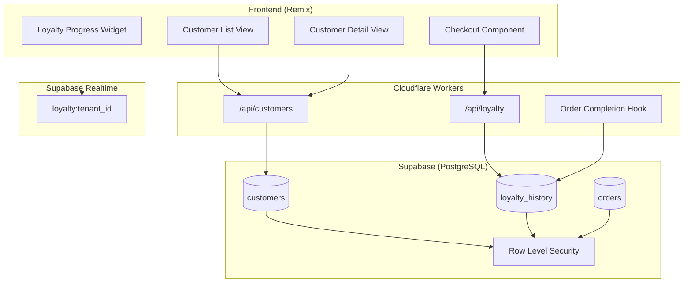

# Design Document: Customer Loyalty Program

## Overview

The Customer Loyalty Program extends the ClubeeShopMkt platform with customer management and a rewards system. The feature tracks customer purchases and automatically applies a 15% discount after 5 qualifying purchases (orders ≥ R$50.00). The system integrates with the existing multi-tenant architecture, Supabase backend, and Remix frontend.

## Architecture



## Components and Interfaces

### Database Layer

#### customers Table
```sql
CREATE TABLE customers (
    id UUID PRIMARY KEY DEFAULT gen_random_uuid(),
    tenant_id UUID NOT NULL REFERENCES tenants(id),
    email TEXT NOT NULL,
    name TEXT NOT NULL,
    phone TEXT,
    qualifying_purchase_count INT DEFAULT 0,
    has_available_discount BOOLEAN DEFAULT FALSE,
    created_at TIMESTAMPTZ DEFAULT NOW(),
    updated_at TIMESTAMPTZ DEFAULT NOW(),
    UNIQUE(tenant_id, email)
);

CREATE INDEX idx_customers_tenant ON customers(tenant_id);
CREATE INDEX idx_customers_email ON customers(tenant_id, email);
CREATE INDEX idx_customers_fts ON customers USING GIN (
    to_tsvector('portuguese', name || ' ' || email || ' ' || COALESCE(phone, ''))
);
```

#### loyalty_history Table
```sql
CREATE TABLE loyalty_history (
    id UUID PRIMARY KEY DEFAULT gen_random_uuid(),
    tenant_id UUID NOT NULL REFERENCES tenants(id),
    customer_id UUID NOT NULL REFERENCES customers(id),
    order_id UUID REFERENCES orders(id),
    event_type TEXT NOT NULL, -- 'qualifying_purchase', 'discount_applied', 'discount_restored', 'manual_adjustment'
    order_total DECIMAL(10,2),
    discount_amount DECIMAL(10,2),
    adjustment_reason TEXT,
    adjusted_by UUID REFERENCES auth.users(id),
    created_at TIMESTAMPTZ DEFAULT NOW()
);

CREATE INDEX idx_loyalty_history_customer ON loyalty_history(customer_id);
CREATE INDEX idx_loyalty_history_tenant ON loyalty_history(tenant_id);
```

#### RLS Policies
```sql
-- Customers table isolation
CREATE POLICY "Tenant isolation for customers" ON customers
FOR ALL USING (tenant_id = (auth.jwt() -> 'app_metadata' ->> 'tenant_id')::uuid);

-- Loyalty history isolation
CREATE POLICY "Tenant isolation for loyalty_history" ON loyalty_history
FOR ALL USING (tenant_id = (auth.jwt() -> 'app_metadata' ->> 'tenant_id')::uuid);
```

### Server Functions (PostgreSQL RPCs)

#### record_qualifying_purchase
```sql
CREATE OR REPLACE FUNCTION record_qualifying_purchase(
    p_customer_id UUID,
    p_order_id UUID,
    p_order_total DECIMAL,
    p_tenant_id UUID
) RETURNS BOOLEAN
LANGUAGE plpgsql SECURITY DEFINER AS $$
DECLARE
    v_new_count INT;
BEGIN
    -- Only process if order total >= 50.00
    IF p_order_total < 50.00 THEN
        RETURN FALSE;
    END IF;

    -- Increment counter and check threshold
    UPDATE customers
    SET qualifying_purchase_count = qualifying_purchase_count + 1,
        has_available_discount = (qualifying_purchase_count + 1) >= 5,
        updated_at = NOW()
    WHERE id = p_customer_id AND tenant_id = p_tenant_id
    RETURNING qualifying_purchase_count INTO v_new_count;

    -- Record history
    INSERT INTO loyalty_history (tenant_id, customer_id, order_id, event_type, order_total)
    VALUES (p_tenant_id, p_customer_id, p_order_id, 'qualifying_purchase', p_order_total);

    RETURN TRUE;
END;
$$;
```

#### apply_loyalty_discount
```sql
CREATE OR REPLACE FUNCTION apply_loyalty_discount(
    p_customer_id UUID,
    p_order_id UUID,
    p_order_subtotal DECIMAL,
    p_tenant_id UUID
) RETURNS DECIMAL
LANGUAGE plpgsql SECURITY DEFINER AS $$
DECLARE
    v_discount_amount DECIMAL;
    v_has_discount BOOLEAN;
BEGIN
    -- Check eligibility
    SELECT has_available_discount INTO v_has_discount
    FROM customers
    WHERE id = p_customer_id AND tenant_id = p_tenant_id;

    IF NOT v_has_discount THEN
        RETURN 0;
    END IF;

    -- Calculate 15% discount
    v_discount_amount := p_order_subtotal * 0.15;

    -- Reset counter and discount flag
    UPDATE customers
    SET qualifying_purchase_count = 0,
        has_available_discount = FALSE,
        updated_at = NOW()
    WHERE id = p_customer_id AND tenant_id = p_tenant_id;

    -- Record discount usage
    INSERT INTO loyalty_history (tenant_id, customer_id, order_id, event_type, discount_amount)
    VALUES (p_tenant_id, p_customer_id, p_order_id, 'discount_applied', v_discount_amount);

    RETURN v_discount_amount;
END;
$$;
```

#### restore_loyalty_discount
```sql
CREATE OR REPLACE FUNCTION restore_loyalty_discount(
    p_customer_id UUID,
    p_order_id UUID,
    p_tenant_id UUID
) RETURNS BOOLEAN
LANGUAGE plpgsql SECURITY DEFINER AS $$
BEGIN
    -- Restore discount eligibility
    UPDATE customers
    SET qualifying_purchase_count = 5,
        has_available_discount = TRUE,
        updated_at = NOW()
    WHERE id = p_customer_id AND tenant_id = p_tenant_id;

    -- Record restoration
    INSERT INTO loyalty_history (tenant_id, customer_id, order_id, event_type)
    VALUES (p_tenant_id, p_customer_id, p_order_id, 'discount_restored');

    RETURN TRUE;
END;
$$;
```

### API Layer (Remix Routes)

#### Customer Management Routes
- `GET /api/customers` - List customers with search/filter
- `POST /api/customers` - Create new customer
- `GET /api/customers/:id` - Get customer details with loyalty status
- `PUT /api/customers/:id` - Update customer profile
- `GET /api/customers/:id/history` - Get purchase and loyalty history

#### Loyalty Routes
- `GET /api/loyalty/status/:customerId` - Get current loyalty status
- `POST /api/loyalty/apply-discount` - Apply discount at checkout
- `POST /api/loyalty/manual-adjust` - Staff manual adjustment (with audit)

### Frontend Components

#### CustomerListView
Displays paginated customer list with search. Uses `useFetcher` for search debouncing (300ms). Shows name, email, phone, and loyalty badge (progress or "Discount Available").

#### CustomerDetailView
Shows full customer profile with:
- Contact information (editable)
- Loyalty progress bar (X/5 purchases)
- Discount availability indicator
- Purchase history timeline
- Manual adjustment form (staff only)

#### LoyaltyProgressWidget
Compact widget for checkout and customer account pages:
- Circular progress indicator
- "X more purchases for 15% off" message
- "Discount Available!" badge when eligible

#### CheckoutLoyaltySection
Integrated into checkout flow:
- Detects customer discount eligibility
- Shows discount preview before confirmation
- Displays original price, discount amount, final price
- Handles discount application on order completion

## Data Models

### TypeScript Interfaces

```typescript
interface Customer {
    id: string;
    tenantId: string;
    email: string;
    name: string;
    phone: string | null;
    qualifyingPurchaseCount: number;
    hasAvailableDiscount: boolean;
    createdAt: Date;
    updatedAt: Date;
}

interface LoyaltyHistoryEntry {
    id: string;
    tenantId: string;
    customerId: string;
    orderId: string | null;
    eventType: 'qualifying_purchase' | 'discount_applied' | 'discount_restored' | 'manual_adjustment';
    orderTotal: number | null;
    discountAmount: number | null;
    adjustmentReason: string | null;
    adjustedBy: string | null;
    createdAt: Date;
}

interface LoyaltyStatus {
    customerId: string;
    qualifyingPurchaseCount: number;
    purchasesUntilDiscount: number;
    hasAvailableDiscount: boolean;
    discountPercentage: number; // Always 15
}

interface DiscountApplication {
    customerId: string;
    orderId: string;
    orderSubtotal: number;
    discountAmount: number;
    finalTotal: number;
}

interface CustomerSearchResult {
    customers: Customer[];
    total: number;
    page: number;
    pageSize: number;
}
```

### Constants

```typescript
const LOYALTY_CONFIG = {
    QUALIFYING_PURCHASE_THRESHOLD: 50.00, // R$50.00
    PURCHASES_FOR_DISCOUNT: 5,
    DISCOUNT_PERCENTAGE: 0.15, // 15%
} as const;
```


## Correctness Properties

*A property is a characteristic or behavior that should hold true across all valid executions of a system—essentially, a formal statement about what the system should do. Properties serve as the bridge between human-readable specifications and machine-verifiable correctness guarantees.*

### Property 1: Customer Creation Completeness

*For any* valid customer input (name, email, phone, tenant_id), creating a customer SHALL result in a stored record containing all provided fields with matching values.

**Validates: Requirements 1.1**

### Property 2: Customer Data Retrieval Completeness

*For any* customer in the system, retrieving their profile SHALL return name, email, phone, qualifying_purchase_count, has_available_discount, and complete purchase history.

**Validates: Requirements 1.2, 7.1, 7.3**

### Property 3: Customer Update Persistence

*For any* existing customer and valid update data, updating the customer SHALL persist the new values while preserving all loyalty_history entries unchanged.

**Validates: Requirements 1.3**

### Property 4: Email Uniqueness Per Tenant

*For any* tenant with an existing customer email, attempting to create another customer with the same email and tenant_id SHALL fail with a uniqueness error.

**Validates: Requirements 1.4**

### Property 5: Search Tenant Isolation

*For any* search query executed in a tenant context, all returned customers SHALL have tenant_id matching the current tenant, and no customers from other tenants SHALL appear in results.

**Validates: Requirements 1.5, 6.3**

### Property 6: Qualifying Purchase Counter Increment

*For any* completed order with total >= R$50.00, recording the purchase SHALL increment the customer's qualifying_purchase_count by exactly 1.

**Validates: Requirements 2.1**

### Property 7: Non-Qualifying Purchase Counter Unchanged

*For any* completed order with total < R$50.00, the customer's qualifying_purchase_count SHALL remain unchanged after processing.

**Validates: Requirements 2.2**

### Property 8: Qualifying Purchase History Recording

*For any* qualifying purchase recorded, a loyalty_history entry SHALL exist with event_type='qualifying_purchase', the correct order_id, order_total, and timestamp.

**Validates: Requirements 2.3, 2.4**

### Property 9: Discount Eligibility Threshold

*For any* customer whose qualifying_purchase_count reaches exactly 5, has_available_discount SHALL become TRUE. *For any* customer with qualifying_purchase_count < 5, has_available_discount SHALL be FALSE.

**Validates: Requirements 3.1, 3.3**

### Property 10: Discount Calculation Accuracy

*For any* order subtotal, the calculated discount amount SHALL equal subtotal × 0.15 (15%).

**Validates: Requirements 3.4**

### Property 11: Discount Application Correctness

*For any* eligible customer (has_available_discount=TRUE) applying a discount to an order, the system SHALL:
- Return the original subtotal, discount amount (15% of subtotal), and final total (subtotal - discount)
- Set qualifying_purchase_count to 0
- Set has_available_discount to FALSE
- Create a loyalty_history entry with event_type='discount_applied', order_id, and discount_amount

**Validates: Requirements 4.1, 4.2, 4.3, 4.4**

### Property 12: Discount Restoration on Cancellation

*For any* cancelled order where a discount was applied, restoring the discount SHALL set qualifying_purchase_count to 5 and has_available_discount to TRUE.

**Validates: Requirements 4.5**

### Property 13: Progress Calculation Accuracy

*For any* customer with qualifying_purchase_count = N (where 0 ≤ N < 5), purchasesUntilDiscount SHALL equal (5 - N). *For any* customer with N ≥ 5, purchasesUntilDiscount SHALL equal 0.

**Validates: Requirements 5.4**

### Property 14: Cross-Tenant Loyalty Isolation

*For any* customer email that exists in multiple tenants, each tenant's customer record SHALL have independent qualifying_purchase_count and has_available_discount values. Purchases in tenant A SHALL NOT affect loyalty progress in tenant B.

**Validates: Requirements 6.1, 6.2, 6.4**

### Property 15: Manual Adjustment Audit Trail

*For any* manual loyalty adjustment, a loyalty_history entry SHALL exist with event_type='manual_adjustment', the adjustment_reason, and adjusted_by (staff user ID).

**Validates: Requirements 7.4**

## Error Handling

### Customer Creation Errors
- **Duplicate Email**: Return 409 Conflict with message "Customer with this email already exists"
- **Invalid Email Format**: Return 400 Bad Request with validation details
- **Missing Required Fields**: Return 400 Bad Request listing missing fields
- **Invalid Tenant Context**: Return 403 Forbidden

### Loyalty Operations Errors
- **Customer Not Found**: Return 404 Not Found
- **No Discount Available**: Return 400 Bad Request with message "Customer has no available discount"
- **Order Not Found**: Return 404 Not Found when linking to non-existent order
- **Concurrent Modification**: Use database transactions to prevent race conditions; retry on conflict

### Search Errors
- **Invalid Search Query**: Return 400 Bad Request with validation details
- **Tenant Context Missing**: Return 403 Forbidden

## Testing Strategy

### Unit Tests
Unit tests verify specific examples and edge cases:

- Customer creation with valid/invalid data
- Email uniqueness constraint enforcement
- Boundary conditions: orders at exactly R$50.00, R$49.99, R$50.01
- Counter at exactly 4, 5, 6 qualifying purchases
- Discount calculation with various subtotals (including edge cases like R$0.01)
- Search with partial matches, special characters, empty results

### Property-Based Tests
Property tests verify universal properties across randomized inputs using **fast-check** library.

Configuration:
- Minimum 100 iterations per property test
- Tag format: **Feature: customer-loyalty-program, Property {number}: {property_text}**

Property tests to implement:
1. Customer creation completeness (Property 1)
2. Email uniqueness per tenant (Property 4)
3. Search tenant isolation (Property 5)
4. Qualifying purchase counter increment (Property 6)
5. Non-qualifying purchase counter unchanged (Property 7)
6. Discount eligibility threshold (Property 9)
7. Discount calculation accuracy (Property 10)
8. Discount application correctness (Property 11)
9. Progress calculation accuracy (Property 13)
10. Cross-tenant loyalty isolation (Property 14)

### Integration Tests
- End-to-end flow: customer creation → 5 qualifying purchases → discount application
- Order cancellation with discount restoration
- Multi-tenant isolation verification
- Realtime subscription updates on loyalty changes
- Concurrent purchase processing (race condition prevention)

### Test Data Generators (fast-check)
```typescript
import * as fc from 'fast-check';

// Customer generator
const customerArb = fc.record({
    name: fc.string({ minLength: 1, maxLength: 100 }),
    email: fc.emailAddress(),
    phone: fc.option(fc.stringOf(fc.constantFrom('0','1','2','3','4','5','6','7','8','9'), { minLength: 10, maxLength: 15 })),
    tenantId: fc.uuid()
});

// Order total generator (in centavos for precision)
const orderTotalArb = fc.integer({ min: 1, max: 1000000 }).map(cents => cents / 100);

// Qualifying order total (>= 50.00)
const qualifyingOrderTotalArb = fc.integer({ min: 5000, max: 1000000 }).map(cents => cents / 100);

// Non-qualifying order total (< 50.00)
const nonQualifyingOrderTotalArb = fc.integer({ min: 1, max: 4999 }).map(cents => cents / 100);

// Purchase count generator (0-10 range for testing)
const purchaseCountArb = fc.integer({ min: 0, max: 10 });
```
