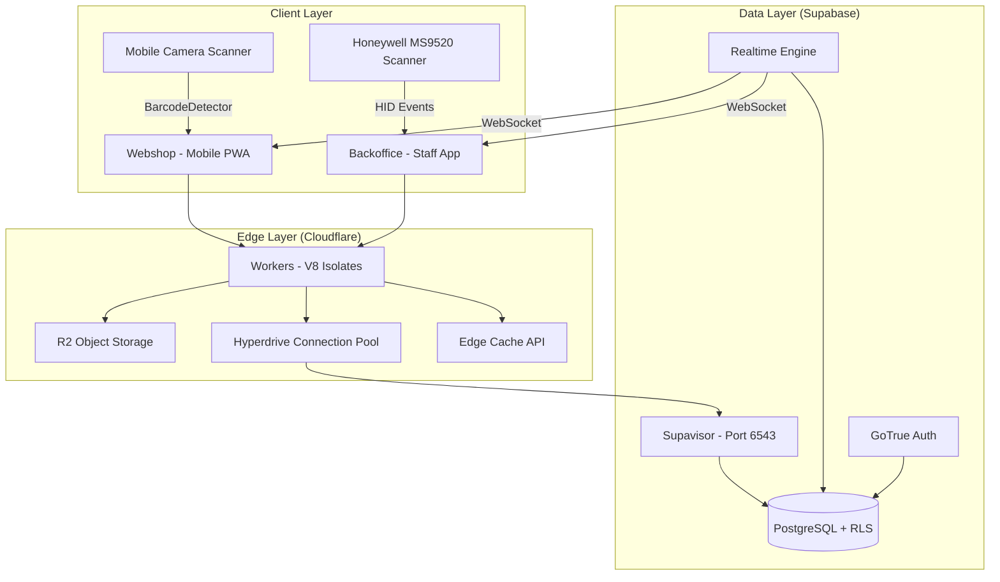
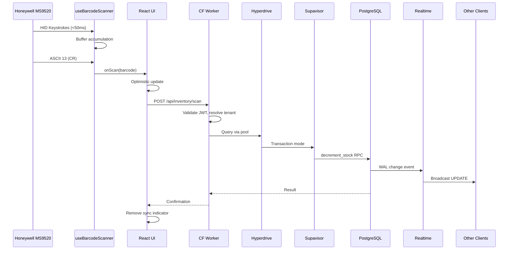
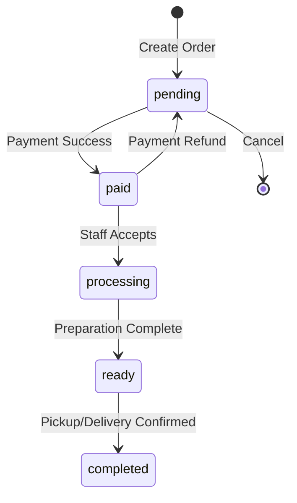
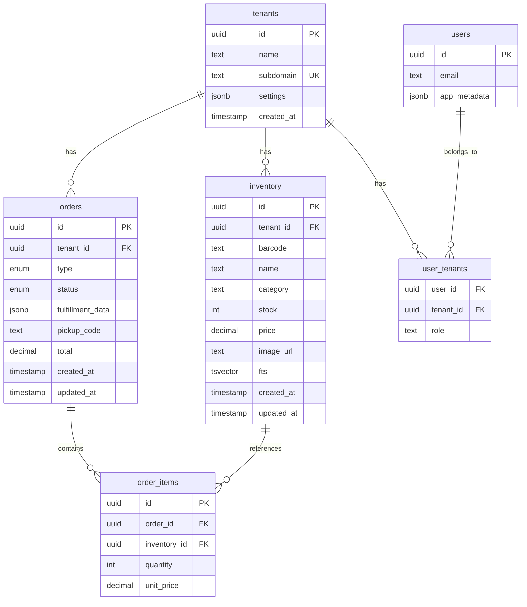

# Design Document: Edge-Native Multi-Tenant Retail Operations Platform

## Overview

This design document describes the architecture for ClubeeShopMkt, an edge-native retail platform consisting of a Product Inventory Manager (backoffice) and Frontend Webshop. The system runs on Cloudflare Workers with Supabase as the persistence layer, featuring real-time inventory synchronization, barcode scanner integration, and a mobile-first UI built with Remix, Shadcn UI, and Framer Motion.

The design follows the NextLevelBuilder UI/UX Pro Max skill guidelines for mobile-first interactions, accessibility compliance (ARIA), and modern design patterns including Glassmorphism and Bento Grid layouts.

## Architecture



### Request Flow Sequence



## Components and Interfaces

### 1. Scanner Integration Layer

#### useBarcodeScanner Hook

```typescript
interface ScannerConfig {
  velocityThreshold: number;  // Default: 50ms
  minBarcodeLength: number;   // Default: 3
  terminatorChar: number;     // ASCII 13 (CR)
  patterns: RegExp[];         // Valid barcode patterns
}

// Default barcode patterns
const DEFAULT_BARCODE_PATTERNS: RegExp[] = [
  /^\d{8}$/,           // UPC-E, EAN-8
  /^\d{12}$/,          // UPC-A
  /^\d{13}$/,          // EAN-13
  /^[A-Z0-9]{1,48}$/,  // Code 128 (alphanumeric)
  /^ORDER:[0-9a-f-]{36}$/i,  // Order QR codes (ORDER:uuid format)
];
```

**Design Rationale:** Pattern validation ensures only valid barcodes trigger scan events, filtering out accidental keyboard input or partial scans. The patterns cover common retail barcode formats plus custom order QR codes. Invalid patterns are rejected silently to avoid disrupting the user experience.

interface ScannerState {
  buffer: string;
  lastKeystroke: number;
  isScanning: boolean;
}

interface UseBarcodeScanner {
  (config: ScannerConfig, onScan: (code: string) => void): {
    isActive: boolean;
    lastScannedCode: string | null;
    reset: () => void;
  };
}
```

**Implementation Strategy:**
- Global `window.onkeydown` listener attached on mount
- Mutable ref for buffer to avoid re-renders during accumulation
- `setTimeout` reset mechanism for velocity detection
- `document.activeElement` check for input pass-through

#### CameraScanner Component

```typescript
interface CameraScannerProps {
  onScan: (code: string) => void;
  formats: BarcodeFormat[];  // ['upc_a', 'ean_13', 'code_128', 'qr_code']
  enabled: boolean;
}
```

**Implementation Strategy:**
- Feature detection for native `BarcodeDetector` API
- Fallback to `html5-qrcode` WebAssembly library
- Unified callback interface with USB scanner

### 2. Multi-Tenancy Layer

#### Tenant Resolution

```typescript
interface Tenant {
  id: string;           // UUID
  name: string;
  subdomain: string;
  settings: TenantSettings;
}

interface TenantResolver {
  fromHostname(hostname: string): Promise<Tenant | null>;
  fromPath(path: string): Promise<Tenant | null>;
  fromJWT(token: string): Tenant;
}
```

**Resolution Priority:**
1. Subdomain: `tenant-a.shop.com` → tenant_id lookup
2. Path: `/shop/tenant-a/...` → tenant_id lookup
3. JWT claim: `app_metadata.tenant_id`

#### RLS Policy Structure

```sql
-- Applied to all tenant-specific tables
CREATE POLICY "tenant_isolation" ON {table}
FOR ALL
USING (tenant_id = (auth.jwt() -> 'app_metadata' ->> 'tenant_id')::uuid)
WITH CHECK (tenant_id = (auth.jwt() -> 'app_metadata' ->> 'tenant_id')::uuid);
```

### 3. Real-Time Synchronization Layer

#### Subscription Manager

```typescript
interface SubscriptionConfig {
  table: string;
  event: 'INSERT' | 'UPDATE' | 'DELETE' | '*';
  filter?: string;  // e.g., `tenant_id=eq.${tenantId}`
}

interface RealtimeManager {
  subscribe(config: SubscriptionConfig, handler: (payload: any) => void): () => void;
  subscribePresence(channel: string, handlers: PresenceHandlers): () => void;
}

interface PresenceHandlers {
  onJoin: (key: string, presence: any) => void;
  onLeave: (key: string, presence: any) => void;
  onSync: () => void;
}
```

### 4. Inventory Management Layer

#### Data Models

```typescript
interface InventoryItem {
  id: string;           // UUID
  tenant_id: string;    // UUID, FK to tenants
  barcode: string;      // Indexed
  name: string;
  category: string;
  stock: number;
  price: number;
  image_url: string | null;
  created_at: string;
  updated_at: string;
}

interface StockOperation {
  item_id: string;
  quantity: number;
  operation: 'increment' | 'decrement' | 'set';
  reason: string;
}
```

#### Atomic Stock RPC

```sql
CREATE OR REPLACE FUNCTION decrement_stock(
  p_item_id UUID,
  p_quantity INT,
  p_tenant_id UUID
) RETURNS BOOLEAN
LANGUAGE plpgsql
SECURITY DEFINER
AS $$
BEGIN
  UPDATE inventory
  SET stock = stock - p_quantity,
      updated_at = NOW()
  WHERE id = p_item_id
    AND tenant_id = p_tenant_id
    AND stock >= p_quantity;
  
  RETURN FOUND;
END;
$$;

CREATE OR REPLACE FUNCTION increment_stock(
  p_item_id UUID,
  p_quantity INT,
  p_tenant_id UUID
) RETURNS BOOLEAN
LANGUAGE plpgsql
SECURITY DEFINER
AS $$
BEGIN
  UPDATE inventory
  SET stock = stock + p_quantity,
      updated_at = NOW()
  WHERE id = p_item_id
    AND tenant_id = p_tenant_id;
  
  RETURN FOUND;
END;
$$;

CREATE OR REPLACE FUNCTION set_stock(
  p_item_id UUID,
  p_quantity INT,
  p_tenant_id UUID
) RETURNS BOOLEAN
LANGUAGE plpgsql
SECURITY DEFINER
AS $$
BEGIN
  UPDATE inventory
  SET stock = p_quantity,
      updated_at = NOW()
  WHERE id = p_item_id
    AND tenant_id = p_tenant_id;
  
  RETURN FOUND;
END;
$$;
```

**Design Rationale:** All stock modifications use atomic PostgreSQL RPCs rather than client-side read-modify-write operations. This ensures data consistency under concurrent access and prevents race conditions that could lead to negative stock levels or lost updates.
```

### 5. Order Management Layer

#### Data Models

```typescript
type OrderType = 'takeout' | 'delivery';
type OrderStatus = 'pending' | 'paid' | 'processing' | 'ready' | 'completed';

interface Order {
  id: string;           // UUID
  tenant_id: string;    // UUID
  type: OrderType;
  status: OrderStatus;
  items: OrderItem[];
  fulfillment_data: TakeoutData | DeliveryData;
  pickup_code: string | null;  // For takeout only
  total: number;
  created_at: string;
  updated_at: string;
}

interface TakeoutData {
  pickup_time: string;
}

interface DeliveryData {
  address: ValidatedAddress;
  delivery_notes: string;
}

interface ValidatedAddress {
  street: string;
  city: string;
  postal_code: string;
  country: string;
  coordinates: { lat: number; lng: number };
}
```

#### Address Validation Component

```typescript
interface AddressAutocompleteProps {
  onAddressSelect: (address: ValidatedAddress) => void;
  initialAddress?: ValidatedAddress;
  placeholder?: string;
}

interface AddressService {
  searchAddresses(query: string): Promise<AddressSuggestion[]>;
  validateAddress(address: Partial<ValidatedAddress>): Promise<ValidatedAddress>;
  geocodeAddress(address: string): Promise<{ lat: number; lng: number }>;
}
```

**Design Rationale:** Address validation integrates with Google Maps Places API or Mapbox Geocoding API to ensure delivery addresses are valid and geocoded. The autocomplete component provides real-time suggestions as users type, reducing errors and improving delivery accuracy. Coordinates are stored for route optimization in the delivery dashboard.
```

#### Order State Machine



#### QR Code Generation and Scanning

```typescript
interface QRCodeService {
  generatePickupQR(orderId: string): string;  // Base64 QR code image
  parseScannedCode(code: string): { type: 'order' | 'product', id: string } | null;
}

// QR code format for orders: ORDER:{order_id}
// Example: "ORDER:123e4567-e89b-12d3-a456-426614174000"
```

**Design Rationale:** QR codes for takeout orders contain the full order UUID prefixed with "ORDER:" to distinguish them from product barcodes. The scanner hook detects this pattern and routes to the order detail view. This approach ensures reliable order identification while maintaining compatibility with existing barcode scanning infrastructure.

### 6. Search Layer

#### Full-Text Search Index

```sql
ALTER TABLE inventory ADD COLUMN fts tsvector
GENERATED ALWAYS AS (
  to_tsvector('english', 
    coalesce(name, '') || ' ' || 
    coalesce(category, '') || ' ' || 
    coalesce(barcode, '')
  )
) STORED;

CREATE INDEX inventory_fts_idx ON inventory USING GIN (fts);
```

#### Search Interface

```typescript
interface SearchResult {
  item: InventoryItem;
  highlights: {
    field: string;
    matches: [number, number][];  // Start/end positions
  }[];
  rank: number;
}

interface SearchService {
  search(query: string, tenantId: string): Promise<SearchResult[]>;
}
```

## Data Models

### Database Schema



### Indexes

| Table | Index | Type | Purpose |
|-------|-------|------|---------|
| inventory | barcode | B-tree | Fast scanner lookup |
| inventory | tenant_id | B-tree | RLS filtering |
| inventory | fts | GIN | Full-text search |
| orders | tenant_id, status | Composite | Dashboard queries |
| orders | pickup_code | B-tree | Takeout lookup |


## UI/UX Design (NextLevelBuilder Pro Max Guidelines)

### Design System

Following the NextLevelBuilder UI/UX Pro Max skill, the interface implements:

**Visual Style:** Modern Glassmorphism with subtle backdrop blur effects
**Layout Pattern:** Bento Grid for dashboard views, single-column for mobile flows
**Color Palette:** Adaptive dark/light themes via Tailwind CSS variables
**Typography:** System font stack with clear hierarchy (48px headers, 16px body)

### Component Library (Shadcn UI)

| Component | Usage | Accessibility |
|-----------|-------|---------------|
| Button | Primary actions, minimum 48px touch target | ARIA labels, focus rings |
| Drawer | Bottom sheets for mobile editing | Focus trap, escape to close |
| Command | Global search palette (CMD+K) | Keyboard navigation |
| Toast (Sonner) | Notifications, error feedback | Auto-dismiss, screen reader |
| Card | Product display, order cards | Semantic HTML |
| Input | Form fields, search | Label association |

### Mobile Navigation Architecture

```typescript
interface BottomDockItem {
  icon: LucideIcon;
  label: string;
  route: string;
  badge?: number;  // Cart count, pending orders
}

const dockItems: BottomDockItem[] = [
  { icon: Scan, label: 'Scan', route: '/scan' },
  { icon: Search, label: 'Search', route: '/search' },
  { icon: ShoppingCart, label: 'Cart', route: '/cart' },
  { icon: Package, label: 'Orders', route: '/orders' },
];
```

**Thumb Zone Optimization:**
- Bottom dock positioned in natural thumb reach
- Primary action (Scan) in center-right position
- All touch targets ≥48px height per WCAG guidelines

### Animation System (Framer Motion)

#### Layout Animations

```typescript
// Cart item animation - item "flies" from list to cart
<motion.div
  layoutId={`product-${item.id}`}
  initial={{ opacity: 0, scale: 0.8 }}
  animate={{ opacity: 1, scale: 1 }}
  exit={{ opacity: 0, scale: 0.8 }}
  transition={{ type: "spring", stiffness: 300, damping: 30 }}
>
  <ProductCard item={item} />
</motion.div>
```

#### Route Transitions

```typescript
// Wrap Remix Outlet for page transitions
<AnimatePresence mode="wait">
  <motion.div
    key={location.pathname}
    initial={{ opacity: 0, x: 20 }}
    animate={{ opacity: 1, x: 0 }}
    exit={{ opacity: 0, x: -20 }}
    transition={{ duration: 0.2 }}
  >
    <Outlet />
  </motion.div>
</AnimatePresence>
```

#### Micro-interactions

| Interaction | Animation | Duration |
|-------------|-----------|----------|
| Button press | Scale 0.95 | 100ms |
| Card hover | Subtle lift (translateY -2px) | 150ms |
| Scan success | Pulse + checkmark | 300ms |
| Error shake | Horizontal oscillation | 400ms |
| Loading | Skeleton shimmer | Continuous |

### Optimistic UI Pattern

```typescript
interface OptimisticState<T> {
  data: T;
  pending: boolean;
  error: Error | null;
}

// Visual states
const SyncIndicator = ({ pending }: { pending: boolean }) => (
  <motion.div
    initial={{ opacity: 0 }}
    animate={{ opacity: pending ? 0.6 : 0 }}
    className="absolute inset-0 bg-background/50 backdrop-blur-sm"
  >
    <Loader2 className="animate-spin" />
  </motion.div>
);
```

## Correctness Properties

*A property is a characteristic or behavior that should hold true across all valid executions of a system—essentially, a formal statement about what the system should do. Properties serve as the bridge between human-readable specifications and machine-verifiable correctness guarantees.*

### Property 1: Tenant Isolation Invariant

*For any* database query executed by an authenticated user, the results SHALL only contain rows where `tenant_id` matches the user's JWT `app_metadata.tenant_id` claim.

**Validates: Requirements 1.2, 1.4**

### Property 2: Scanner Velocity Discrimination

*For any* sequence of keystrokes, if all inter-keystroke intervals are below 50ms and the sequence ends with ASCII 13, the Scanner_Hook SHALL emit exactly one onScan event with the accumulated buffer.

**Validates: Requirements 2.2, 2.3, 2.4**

### Property 3: Scanner Input Passthrough

*For any* keystroke event occurring while `document.activeElement` is an input or textarea, the Scanner_Hook SHALL NOT accumulate the keystroke in its buffer.

**Validates: Requirements 2.5**

### Property 4: Unified Scan Handler

*For any* barcode detected via USB scanner OR camera scanner, the system SHALL invoke the identical `handleItemScan(code)` function.

**Validates: Requirements 3.3**

### Property 5: Stock Non-Negativity Invariant

*For any* sequence of concurrent `decrement_stock` operations, the resulting stock value SHALL never be negative.

**Validates: Requirements 5.1, 5.2, 5.3**

### Property 6: Atomic Stock Decrement

*For any* `decrement_stock(item_id, quantity, tenant_id)` call where `current_stock >= quantity`, the function SHALL return true AND reduce stock by exactly `quantity`.

**Validates: Requirements 5.1, 5.2**

### Property 7: Realtime Tenant Filtering

*For any* Realtime subscription with a tenant_id filter, broadcast events SHALL only be received by clients subscribed with matching tenant_id.

**Validates: Requirements 4.3**

### Property 8: Optimistic UI Consistency

*For any* optimistic update followed by server confirmation, the final UI state SHALL match the server-confirmed state.

**Validates: Requirements 12.1, 12.3**

### Property 9: Optimistic UI Rollback

*For any* optimistic update followed by server error, the UI state SHALL revert to the pre-update state AND display an error notification.

**Validates: Requirements 12.4**

### Property 10: Order State Machine Validity

*For any* order status transition, the transition SHALL only occur along valid edges in the state machine (pending→paid→processing→ready→completed).

**Validates: Requirements 14.5**

### Property 11: Search Debounce Behavior

*For any* sequence of search input keystrokes within 300ms, the system SHALL execute at most one search query.

**Validates: Requirements 10.2**

### Property 12: Full-Text Search Round Trip

*For any* inventory item with non-empty name, category, or barcode, searching for any word from those fields SHALL return that item in results.

**Validates: Requirements 10.1**

### Property 13: QR Code Round Trip

*For any* generated pickup QR code containing an order_id, scanning that QR code SHALL resolve to the same order_id.

**Validates: Requirements 8.2, 8.3**

### Property 14: JWT Tenant Injection

*For any* successful user authentication, the resulting JWT SHALL contain a valid tenant_id in `app_metadata`.

**Validates: Requirements 1.3, 13.2**

### Property 15: Connection Pool Return

*For any* database transaction executed via Supavisor Transaction Mode, the connection SHALL be returned to the pool within 100ms of transaction completion.

**Validates: Requirements 7.3**

## Error Handling

### Error Categories

| Category | HTTP Status | User Message | Recovery Action |
|----------|-------------|--------------|-----------------|
| Auth Expired | 401 | "Session expired" | Redirect to login |
| Tenant Not Found | 404 | "Shop not found" | Show error page |
| Stock Insufficient | 409 | "Item out of stock" | Remove from cart, show toast |
| Rate Limited | 429 | "Too many requests" | Exponential backoff |
| Network Error | 0 | "Connection lost" | Retry with indicator |
| Scanner Error | - | "Invalid barcode" | Clear buffer, beep |

### Rate Limiting Strategy

```typescript
interface RateLimitConfig {
  windowMs: number;     // Time window in milliseconds
  maxRequests: number;  // Maximum requests per window
  keyGenerator: (request: Request) => string;  // IP or user-based
}

// Rate limits by endpoint
const rateLimits = {
  '/api/auth/login': { windowMs: 60000, maxRequests: 5 },      // 5 per minute
  '/api/inventory/search': { windowMs: 1000, maxRequests: 10 }, // 10 per second
  '/api/orders': { windowMs: 60000, maxRequests: 100 },        // 100 per minute
};
```

**Design Rationale:** Rate limiting prevents abuse and ensures fair resource usage across tenants. Login endpoints have stricter limits to prevent brute force attacks, while search endpoints allow higher throughput for responsive UI. Limits are enforced at the Cloudflare Worker level using Durable Objects for distributed state.

### Error Boundaries

```typescript
// Route-level error boundary
export function ErrorBoundary() {
  const error = useRouteError();
  
  if (isRouteErrorResponse(error)) {
    return <ErrorPage status={error.status} message={error.data} />;
  }
  
  return <ErrorPage status={500} message="Something went wrong" />;
}
```

### Retry Strategy

```typescript
interface RetryConfig {
  maxAttempts: number;      // Default: 3
  baseDelay: number;        // Default: 1000ms
  maxDelay: number;         // Default: 10000ms
  backoffFactor: number;    // Default: 2
}

// Exponential backoff for transient failures
const delay = Math.min(
  config.baseDelay * Math.pow(config.backoffFactor, attempt),
  config.maxDelay
);
```

## Testing Strategy

### Unit Tests

Unit tests verify specific examples and edge cases:

- Scanner buffer accumulation with various timing patterns
- Tenant resolution from different hostname formats
- Order state machine transition validation
- Search query debouncing behavior
- Barcode pattern validation

### Property-Based Tests

Property-based tests verify universal properties across generated inputs:

**Framework:** fast-check (TypeScript)
**Minimum iterations:** 100 per property

Each property test must be tagged with:
```typescript
// Feature: retail-inventory-platform, Property 5: Stock Non-Negativity Invariant
// Validates: Requirements 5.1, 5.2, 5.3
```

**Test Categories:**

1. **Invariant Tests**
   - Tenant isolation across all queries
   - Stock non-negativity under concurrent operations
   - Order state machine validity

2. **Round-Trip Tests**
   - QR code generation/scanning
   - Full-text search indexing/querying
   - JWT encoding/decoding with tenant claims

3. **Idempotence Tests**
   - Cache invalidation operations
   - Presence join/leave events

4. **Metamorphic Tests**
   - Search results subset relationship (more specific query → fewer results)
   - Stock decrement ordering independence

### Integration Tests

- End-to-end scan-to-cart flow
- Realtime subscription across multiple clients
- Multi-tenant data isolation verification
- Edge cache invalidation propagation

### Test Environment

```typescript
// Supabase local development
// npx supabase start

// Test database seeding
interface TestTenant {
  id: string;
  name: string;
  inventory: InventoryItem[];
}

// Isolated test tenants per test suite
const createTestTenant = async (): Promise<TestTenant> => {
  // Creates tenant with unique subdomain
  // Seeds inventory with generated items
  // Returns cleanup function
};
```
