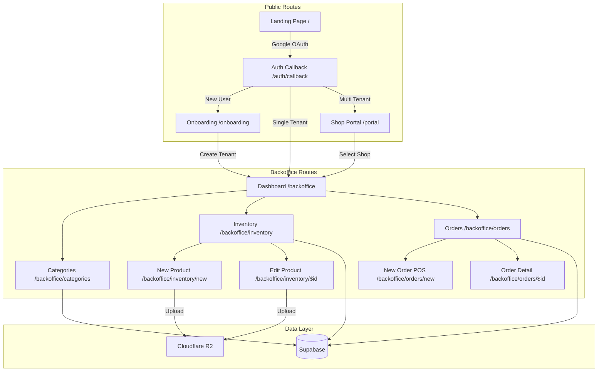
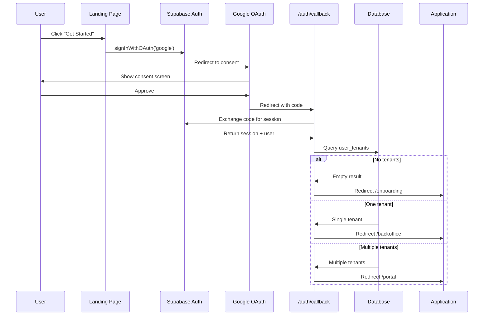
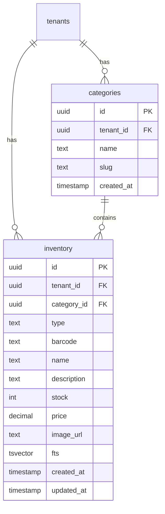

# Design Document: SaaS Expansion & Core Management

## Overview

This design document describes the architecture for expanding ClubeeShopMkt into a full Multi-Tenant SaaS platform. The expansion adds self-service onboarding, Google OAuth authentication, category management, product/service catalog, and POS-style manual order creation.

The design follows the NextLevelBuilder UI/UX Pro Max skill guidelines, implementing Glassmorphism visual style, Bento Grid layouts, and Framer Motion animations with Shadcn UI components.

## Architecture



### Authentication Flow



## Components and Interfaces

### 1. Landing Page Components

#### Hero Section

```typescript
interface HeroProps {
  headline: string;
  subheadline: string;
  ctaPrimary: { label: string; href: string };
  ctaSecondary: { label: string; href: string };
}
```

**Visual Design (Glassmorphism):**
- Full-width gradient background with animated mesh
- Centered content with large typography (48-64px headline)
- Glassmorphic CTA buttons with backdrop blur
- Subtle floating elements with parallax on scroll

#### Features Bento Grid

```typescript
interface BentoGridItem {
  title: string;
  description: string;
  icon: LucideIcon;
  size: 'small' | 'medium' | 'large';
  gradient?: string;
}

interface FeaturesGridProps {
  items: BentoGridItem[];
}
```

**Bento Grid Layout:**
```
┌─────────────┬───────┬───────┐
│   Large     │  Med  │  Med  │
│  Feature    │       │       │
├───────┬─────┼───────┴───────┤
│  Med  │ Sm  │    Large      │
│       │     │   Feature     │
└───────┴─────┴───────────────┘
```

### 2. Authentication Components

#### Google OAuth Button

```typescript
interface GoogleAuthButtonProps {
  mode: 'signin' | 'signup';
  onSuccess?: () => void;
  onError?: (error: Error) => void;
}
```

**Animation:** Scale 0.95 on press, loading spinner during OAuth redirect

#### Onboarding Form

```typescript
interface OnboardingFormData {
  shopName: string;
  subdomain: string;
}

interface OnboardingFormProps {
  onSubmit: (data: OnboardingFormData) => Promise<void>;
  isLoading: boolean;
}
```

**Validation:**
- Shop name: Required, 2-50 characters
- Subdomain: Required, 3-30 characters, lowercase alphanumeric + hyphens, unique

### 3. Category Management

#### Category Data Model

```typescript
interface Category {
  id: string;           // UUID
  tenant_id: string;    // UUID
  name: string;
  slug: string;         // URL-safe, auto-generated from name
  created_at: string;
}

interface CategoryFormData {
  name: string;
}
```

#### Category Manager Component

```typescript
interface CategoryManagerProps {
  categories: Category[];
  onAdd: (data: CategoryFormData) => Promise<void>;
  onEdit: (id: string, data: CategoryFormData) => Promise<void>;
  onDelete: (id: string) => Promise<void>;
}
```

**UI Pattern:** Inline editing with optimistic updates

### 4. Product/Service Catalog

#### Extended Inventory Model

```typescript
type InventoryType = 'physical' | 'service';

interface InventoryItem {
  id: string;
  tenant_id: string;
  type: InventoryType;
  barcode: string | null;      // Required for physical, null for service
  name: string;
  description: string | null;
  category_id: string | null;
  stock: number;               // Required for physical, 0 for service
  price: number;
  image_url: string | null;
  created_at: string;
  updated_at: string;
}

interface ProductFormData {
  type: InventoryType;
  name: string;
  description?: string;
  category_id?: string;
  barcode?: string;            // Required if type === 'physical'
  stock?: number;              // Required if type === 'physical'
  price: number;
  image?: File;
}
```

#### Product Form Component

```typescript
interface ProductFormProps {
  initialData?: InventoryItem;
  categories: Category[];
  onSubmit: (data: ProductFormData) => Promise<void>;
  onCancel: () => void;
  isLoading: boolean;
}
```

**Form Behavior:**
- Type toggle switches between Physical Product and Service modes
- Physical mode shows: barcode (required), stock (required), image upload
- Service mode hides: barcode, stock fields
- Real-time barcode uniqueness validation

### 5. Order Management

#### Order List Component

```typescript
type OrderTab = 'active' | 'completed' | 'cancelled';

interface OrderListFilters {
  tab: OrderTab;
  dateFrom?: string;
  dateTo?: string;
  status?: OrderStatus;
}

interface OrderListProps {
  orders: Order[];
  filters: OrderListFilters;
  onFilterChange: (filters: OrderListFilters) => void;
  onOrderSelect: (orderId: string) => void;
}
```

**Tab Definitions:**
- Active: pending, paid, processing, ready
- Completed: completed
- Cancelled: cancelled (future state)

#### POS Interface Component

```typescript
interface POSCartItem {
  inventory_id: string;
  name: string;
  price: number;
  quantity: number;
  type: InventoryType;
  available_stock: number;     // For physical products
}

interface POSInterfaceProps {
  onCheckout: (items: POSCartItem[], type: OrderType) => Promise<void>;
}

interface POSState {
  cart: POSCartItem[];
  searchQuery: string;
  fulfillmentType: OrderType;
  isProcessing: boolean;
}
```

**POS Flow:**
1. Search/scan product → Add to cart
2. Adjust quantities → Update totals
3. Select fulfillment type → Takeout or Delivery
4. Checkout → Create order, decrement stock

### 6. Image Upload Service

```typescript
interface ImageUploadResult {
  url: string;
  key: string;
}

interface ImageUploadService {
  upload(file: File, tenantId: string): Promise<ImageUploadResult>;
  delete(key: string): Promise<void>;
}
```

**Storage Strategy:**
- Primary: Cloudflare R2 (already configured)
- Path format: `{tenant_id}/products/{uuid}.{ext}`
- Max size: 5MB
- Formats: JPEG, PNG, WebP

## Data Models

### Database Schema Updates

```sql
-- 1. Create Categories Table
CREATE TABLE categories (
  id UUID PRIMARY KEY DEFAULT gen_random_uuid(),
  tenant_id UUID NOT NULL REFERENCES tenants(id) ON DELETE CASCADE,
  name TEXT NOT NULL,
  slug TEXT NOT NULL,
  created_at TIMESTAMPTZ DEFAULT NOW(),
  UNIQUE(tenant_id, slug)
);

-- 2. Add RLS Policy for Categories
ALTER TABLE categories ENABLE ROW LEVEL SECURITY;

CREATE POLICY "tenant_isolation" ON categories
FOR ALL
USING (tenant_id = (auth.jwt() -> 'app_metadata' ->> 'tenant_id')::uuid)
WITH CHECK (tenant_id = (auth.jwt() -> 'app_metadata' ->> 'tenant_id')::uuid);

-- 3. Update Inventory Table
ALTER TABLE inventory 
  ADD COLUMN type TEXT DEFAULT 'physical' CHECK (type IN ('physical', 'service')),
  ADD COLUMN description TEXT,
  ADD COLUMN category_id UUID REFERENCES categories(id) ON DELETE SET NULL;

-- 4. Create Index on category_id
CREATE INDEX inventory_category_id_idx ON inventory(category_id);

-- 5. Update FTS to include description
DROP INDEX IF EXISTS inventory_fts_idx;

ALTER TABLE inventory DROP COLUMN IF EXISTS fts;

ALTER TABLE inventory ADD COLUMN fts tsvector
GENERATED ALWAYS AS (
  to_tsvector('english', 
    coalesce(name, '') || ' ' || 
    coalesce(category, '') || ' ' ||
    coalesce(description, '') || ' ' ||
    coalesce(barcode, '')
  )
) STORED;

CREATE INDEX inventory_fts_idx ON inventory USING GIN (fts);
```

### Entity Relationship Updates



## UI/UX Design (NextLevelBuilder Pro Max Guidelines)

### Visual Style: Glassmorphism

**Card Surfaces:**
```css
.glass-card {
  background: rgba(255, 255, 255, 0.8);
  backdrop-filter: blur(12px);
  border: 1px solid rgba(255, 255, 255, 0.2);
  border-radius: 16px;
  box-shadow: 0 4px 30px rgba(0, 0, 0, 0.1);
}

.dark .glass-card {
  background: rgba(15, 23, 42, 0.8);
  border: 1px solid rgba(255, 255, 255, 0.1);
}
```

**Tailwind Classes:**
```
bg-white/80 dark:bg-slate-900/80 backdrop-blur-xl border border-white/20 dark:border-white/10 rounded-2xl shadow-xl
```

### Layout: Bento Grid

**Landing Page Features Grid:**
```typescript
const bentoItems: BentoGridItem[] = [
  {
    title: 'Inventory Management',
    description: 'Track stock in real-time with barcode scanning',
    icon: Package,
    size: 'large',
    gradient: 'from-blue-500 to-cyan-500'
  },
  {
    title: 'Multi-Tenant',
    description: 'Each shop gets its own subdomain',
    icon: Building2,
    size: 'medium'
  },
  {
    title: 'POS System',
    description: 'Process walk-in sales instantly',
    icon: CreditCard,
    size: 'medium'
  },
  {
    title: 'Services',
    description: 'Sell services alongside products',
    icon: Wrench,
    size: 'small'
  },
  {
    title: 'Categories',
    description: 'Organize your catalog',
    icon: FolderTree,
    size: 'small'
  },
  {
    title: 'Real-Time Sync',
    description: 'Changes appear instantly everywhere',
    icon: RefreshCw,
    size: 'large',
    gradient: 'from-purple-500 to-pink-500'
  }
];
```

### Animation System (Framer Motion)

#### Route Transitions

```typescript
// app/components/ui/PageTransition.tsx
const pageVariants = {
  initial: { opacity: 0, y: 20 },
  animate: { opacity: 1, y: 0 },
  exit: { opacity: 0, y: -20 }
};

const pageTransition = {
  type: 'tween',
  ease: 'easeInOut',
  duration: 0.3
};

export function PageTransition({ children }: { children: React.ReactNode }) {
  return (
    <motion.div
      variants={pageVariants}
      initial="initial"
      animate="animate"
      exit="exit"
      transition={pageTransition}
    >
      {children}
    </motion.div>
  );
}
```

#### Micro-Interactions

| Interaction | Animation | Framer Motion Config |
|-------------|-----------|---------------------|
| Button press | Scale down | `whileTap={{ scale: 0.95 }}` |
| Card hover | Lift + shadow | `whileHover={{ y: -2, boxShadow: '...' }}` |
| Form submit | Loading spinner | `animate={{ rotate: 360 }}` with `repeat: Infinity` |
| Success | Checkmark + pulse | `scale: [1, 1.2, 1]` with spring |
| Error | Horizontal shake | `x: [0, -10, 10, -10, 10, 0]` |
| Drawer open | Slide from bottom | `initial={{ y: '100%' }}` `animate={{ y: 0 }}` |
| List item | Stagger entrance | `staggerChildren: 0.05` |

#### Bento Grid Animation

```typescript
const containerVariants = {
  hidden: { opacity: 0 },
  visible: {
    opacity: 1,
    transition: {
      staggerChildren: 0.1
    }
  }
};

const itemVariants = {
  hidden: { opacity: 0, y: 20 },
  visible: { 
    opacity: 1, 
    y: 0,
    transition: { type: 'spring', stiffness: 300, damping: 24 }
  }
};
```

### Shadcn UI Component Mapping

| Feature | Component | Customization |
|---------|-----------|---------------|
| Landing CTAs | Button | `variant="default"` with gradient bg |
| Feature cards | Card | Glassmorphism styling |
| Onboarding form | Input, Button | Focus ring, error states |
| Category list | Table | Inline edit mode |
| Product form | Input, Select, Drawer | Type toggle, image preview |
| Order list | Table, Tabs, Badge | Status badges with colors |
| POS cart | Card, Button, Input | Quantity stepper |
| Notifications | Sonner Toast | Success/error variants |
| Mobile nav | Drawer | Bottom sheet pattern |

### Color Palette (SaaS Theme)

```typescript
// tailwind.config.ts extension
const colors = {
  primary: {
    50: '#eff6ff',
    500: '#3b82f6',
    600: '#2563eb',
    700: '#1d4ed8'
  },
  success: {
    500: '#22c55e'
  },
  warning: {
    500: '#f59e0b'
  },
  error: {
    500: '#ef4444'
  }
};
```

### Status Badge Colors

| Status | Background | Text |
|--------|------------|------|
| pending | `bg-yellow-100` | `text-yellow-800` |
| paid | `bg-blue-100` | `text-blue-800` |
| processing | `bg-purple-100` | `text-purple-800` |
| ready | `bg-green-100` | `text-green-800` |
| completed | `bg-gray-100` | `text-gray-800` |

### Product vs Service Visual Distinction

| Type | Icon | Badge | Card Accent |
|------|------|-------|-------------|
| Physical | `Package` | None | Default |
| Service | `Wrench` | "Service" pill | Purple left border |


## Correctness Properties

*A property is a characteristic or behavior that should hold true across all valid executions of a system—essentially, a formal statement about what the system should do. Properties serve as the bridge between human-readable specifications and machine-verifiable correctness guarantees.*


### Property 1: Post-Authentication Routing

*For any* authenticated user, the system SHALL route to /onboarding if tenant count is 0, to /backoffice if tenant count is 1, and to /portal if tenant count is greater than 1.

**Validates: Requirements 3.1, 4.1, 4.2**

### Property 2: Subdomain Uniqueness

*For any* subdomain string, attempting to create a tenant with that subdomain when it already exists SHALL fail with a uniqueness error.

**Validates: Requirements 3.4, 3.5**

### Property 3: Onboarding Creates Tenant with Owner

*For any* valid onboarding submission (shop name, subdomain), the system SHALL create a tenant record AND a user_tenant record with role 'owner' linking the current user.

**Validates: Requirements 3.6, 3.7**

### Property 4: JWT Tenant Injection After Onboarding

*For any* completed onboarding flow, the user's JWT app_metadata SHALL contain the newly created tenant_id.

**Validates: Requirements 3.8**

### Property 5: Tenant Selection Updates Session

*For any* tenant selection from the portal, the user's session SHALL be updated with the selected tenant_id.

**Validates: Requirements 4.4**

### Property 6: Category Slug Uniqueness Per Tenant

*For any* tenant, attempting to create two categories with the same slug SHALL fail with a uniqueness error, but different tenants MAY have categories with identical slugs.

**Validates: Requirements 5.2**

### Property 7: Category Deletion Cascades to Inventory

*For any* category deletion, all inventory items referencing that category SHALL have their category_id set to NULL.

**Validates: Requirements 5.7**

### Property 8: Physical Product Validation

*For any* inventory item with type 'physical', the stock field SHALL be >= 0 and the barcode field SHALL be non-empty.

**Validates: Requirements 6.4**

### Property 9: Barcode Uniqueness Per Tenant

*For any* tenant, attempting to create two inventory items with the same barcode SHALL fail with a uniqueness error.

**Validates: Requirements 6.8, 6.9**

### Property 10: Order List Filtering and Sorting

*For any* order list query with status filter, date range filter, or sort order, the returned orders SHALL match all filter criteria AND be sorted correctly.

**Validates: Requirements 7.4, 7.5, 7.6**

### Property 11: POS Product Search

*For any* search query in the POS interface, the results SHALL include all products where the name OR barcode contains the query string.

**Validates: Requirements 8.2**

### Property 12: POS Cart State Management

*For any* sequence of cart operations (add, adjust quantity, remove), the cart state SHALL correctly reflect all operations and the running total SHALL equal the sum of (price × quantity) for all items.

**Validates: Requirements 8.4, 8.5, 8.6, 8.7**

### Property 13: POS Order Creation

*For any* POS checkout with valid cart items, the system SHALL create an Order record with correct items, total, and fulfillment type.

**Validates: Requirements 8.9**

### Property 14: POS Stock Validation

*For any* POS checkout containing physical products, IF any item has insufficient stock, THEN the order SHALL be rejected AND the response SHALL identify which items are unavailable.

**Validates: Requirements 8.11**

### Property 15: Valid Status Transitions Display

*For any* order with a given status, the status dropdown SHALL only display states that are valid transitions according to the order state machine.

**Validates: Requirements 9.2**

## Error Handling

### Error Categories

| Category | HTTP Status | User Message | Recovery Action |
|----------|-------------|--------------|-----------------|
| OAuth Failed | 401 | "Sign in failed. Please try again." | Redirect to landing |
| Subdomain Taken | 409 | "This subdomain is already in use" | Show inline error |
| Invalid Form | 400 | Field-specific messages | Highlight invalid fields |
| Duplicate Barcode | 409 | "This barcode already exists" | Show inline error |
| Insufficient Stock | 409 | "Not enough stock for: {items}" | Show unavailable items |
| Invalid Transition | 400 | "Cannot change status from X to Y" | Show valid options |
| Upload Failed | 500 | "Image upload failed" | Retry button |
| Network Error | 0 | "Connection lost" | Retry with indicator |

### Form Validation

```typescript
// Onboarding form validation
const onboardingSchema = z.object({
  shopName: z.string().min(2).max(50),
  subdomain: z.string()
    .min(3)
    .max(30)
    .regex(/^[a-z0-9-]+$/, 'Only lowercase letters, numbers, and hyphens')
    .refine(async (val) => !(await isSubdomainTaken(val)), 'Subdomain is taken')
});

// Product form validation
const productSchema = z.object({
  type: z.enum(['physical', 'service']),
  name: z.string().min(1).max(100),
  description: z.string().max(500).optional(),
  category_id: z.string().uuid().optional(),
  price: z.number().min(0),
  barcode: z.string().min(1).optional(),
  stock: z.number().int().min(0).optional()
}).refine(
  (data) => data.type !== 'physical' || (data.barcode && data.stock !== undefined),
  { message: 'Physical products require barcode and stock' }
);
```

## Testing Strategy

### Unit Tests

Unit tests verify specific examples and edge cases:

- Subdomain validation regex patterns
- Slug generation from category names
- Cart total calculation
- Order status transition validation
- Form validation schemas

### Property-Based Tests

Property-based tests verify universal properties across generated inputs:

**Framework:** fast-check (TypeScript)
**Minimum iterations:** 100 per property

Each property test must be tagged with:
```typescript
// Feature: saas-expansion, Property N: Property Title
// Validates: Requirements X.Y
```

**Test Categories:**

1. **Uniqueness Tests**
   - Subdomain uniqueness across tenants
   - Category slug uniqueness within tenant
   - Barcode uniqueness within tenant

2. **State Management Tests**
   - Post-auth routing based on tenant count
   - POS cart operations and total calculation
   - Order status transitions

3. **Cascade Tests**
   - Category deletion nullifies inventory references

4. **Validation Tests**
   - Physical product requires barcode and stock
   - Stock validation on checkout

### Integration Tests

- Google OAuth flow end-to-end
- Onboarding creates tenant and user_tenant
- Image upload to R2/Supabase Storage
- POS checkout with stock decrement
- Real-time category updates

### Test Environment

```typescript
// Test tenant factory
const createTestTenant = async (subdomain: string) => {
  const tenant = await db.tenants.create({
    name: `Test Shop ${subdomain}`,
    subdomain,
    settings: {}
  });
  return tenant;
};

// Test user with tenant
const createTestUserWithTenant = async (tenantCount: number) => {
  const user = await createTestUser();
  for (let i = 0; i < tenantCount; i++) {
    const tenant = await createTestTenant(`test-${i}-${Date.now()}`);
    await db.user_tenants.create({
      user_id: user.id,
      tenant_id: tenant.id,
      role: 'owner'
    });
  }
  return user;
};
```
